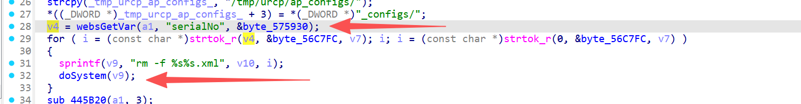

# FUN_00445c5c 漏洞信息

## 基础信息
- **影响组件**: /gohead/sub_445C5C
- **固件版本**: nv518GV3v3.2.7-210919-161313

## 漏洞详情

/gohead/sub_445C5C

The sprintf(v9, "rm -f %s%s.xml", v10, i) and doSystem(v9) allow command injection. The attacker controls i via the serialNo parameter. By injecting shell metacharacters like ;, |, or $(), the attacker can execute arbitrary system commands. For example, serialNo=eth0; cat /etc/passwd runs cat /etc/passwd on the target. No input sanitization is performed, making this a critical vulnerability that leads to full system compromise.