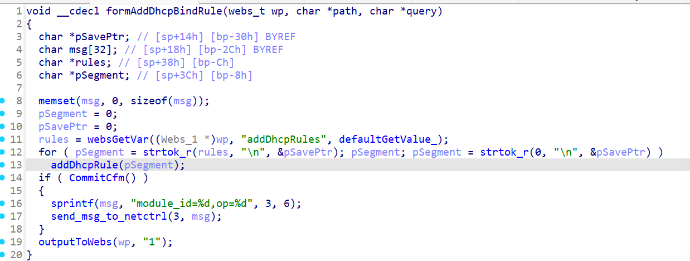
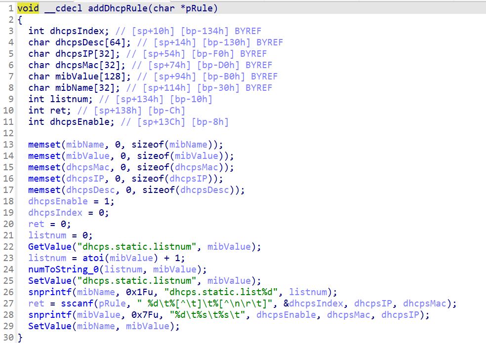

# CVE-2026-24110 漏洞信息

## 基础信息
- **CVE编号**: CVE-2026-24110
- **影响组件**: goform/formAddDhcpBindRule
- **固件版本**: Tenda W20E V4.0br_V15.11.0.6

## 漏洞详情

formAddDhcpBindRule

Attackers may send overly long `addDhcpRules` data. When these rules enter the `addDhcpRule` function and are processed by `ret = sscanf(pRule, " %d\t%[^\t]\t%[^\n\r\t]", &dhcpsIndex, dhcpsIP, dhcpsMac);`, the lack of size validation for the rules could lead to buffer overflows in `dhcpsIndex`, `dhcpsIP`, and `dhcpsMac`.

addDhcpRules=>sscanf=>buffer overflow
