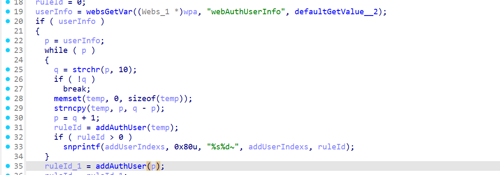
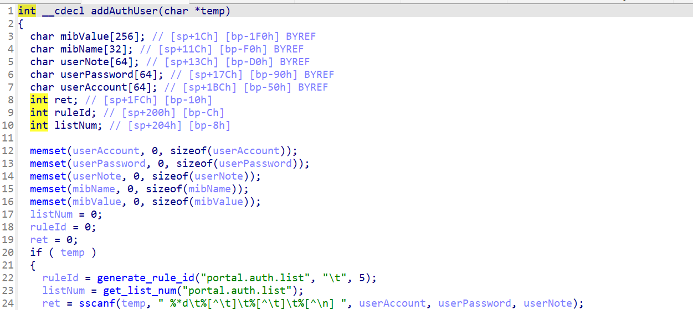

# CVE-2026-24111 漏洞信息

## 基础信息
- **CVE编号**: CVE-2026-24111
- **影响组件**: goform/formAddWebAuthUse
- **固件版本**: Tenda W20E V4.0br_V15.11.0.6

## 漏洞详情

formAddWebAuthUser

Attackers may exploit the vulnerability by specifying the value of `userInfo`. When `userInfo` is passed into the `addAuthUser` function and processed by `sscanf` without size validation, it could lead to buffer overflow.
