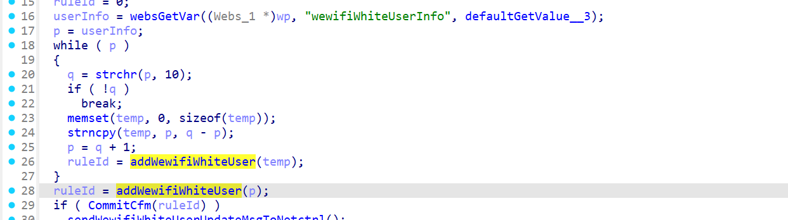
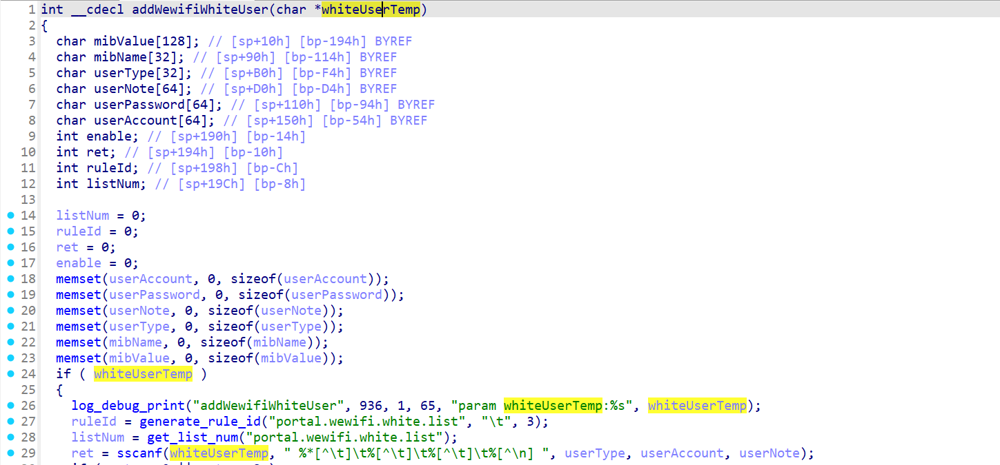

# CVE-2026-24112 漏洞信息

## 基础信息
- **CVE编号**: CVE-2026-24112
- **影响组件**: goform/formAddWewifiWhiteUser
- **固件版本**: Tenda W20E V4.0br_V15.11.0.6

## 漏洞详情

formAddWewifiWhiteUser

Attackers may exploit the vulnerability by specifying the value of `userInfo`. When `userInfo` is passed into the `addWewifiWhiteUser` function and processed by `sscanf` without size validation, it could lead to a buffer overflow vulnerability.
