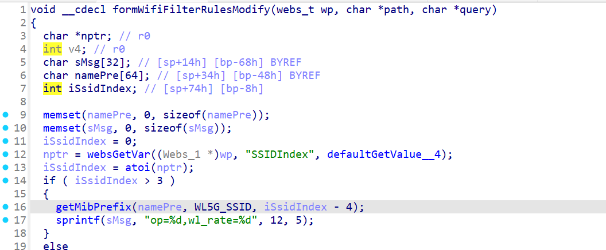
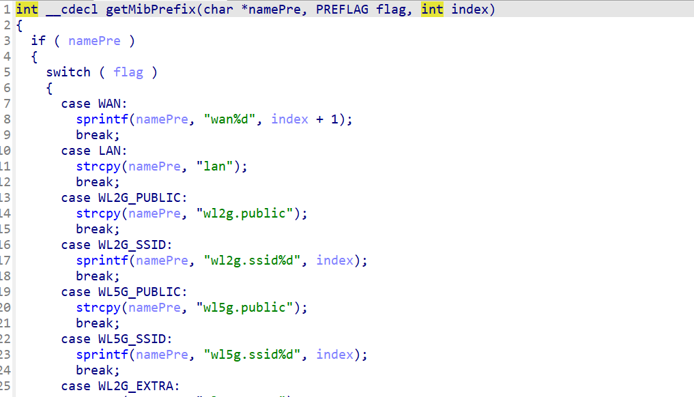

# CVE-2026-24113 漏洞信息

## 基础信息
- **CVE编号**: CVE-2026-24113
- **影响组件**: goform/formWifiFilterRulesModify
- **固件版本**: Tenda W20E V4.0br_V15.11.0.6

## 漏洞详情

formWifiFilterRulesModify

Attackers may exploit the vulnerability by controlling the value of `nptr`. When this value is passed into the `getMibPrefix` function and concatenated using `sprintf` without proper size validation, it could lead to a buffer overflow vulnerability.
