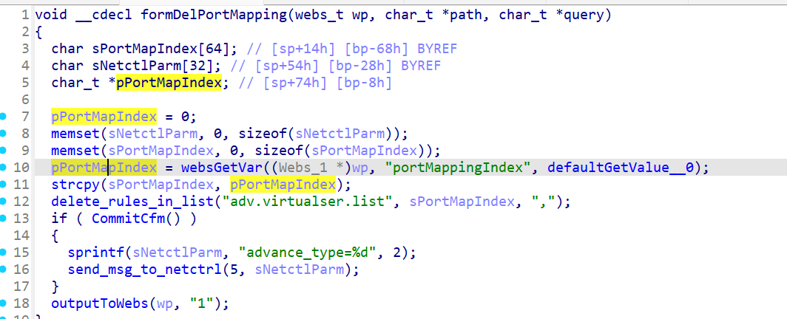

# CVE-2026-24114 漏洞信息

## 基础信息
- **CVE编号**: CVE-2026-24114
- **影响组件**: goform/formDelPortMapping
- **固件版本**: Tenda W20E V4.0br_V15.11.0.6

## 漏洞详情

formDelPortMapping

Failure to validate `pPortMapIndex` may lead to buffer overflows when using `strcpy`.
