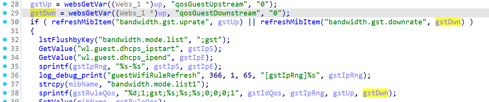

# CVE-2026-24115 漏洞信息

## 基础信息
- **CVE编号**: CVE-2026-24115
- **影响组件**: goform/guestWifiRuleRefresh
- **固件版本**: Tenda W20E V4.0br_V15.11.0.6

## 漏洞详情

guestWifiRuleRefresh

Failure to validate the sizes of `gstup` and `gstdwn` before concatenating them into `gstruleQos` may lead to buffer overflow.
